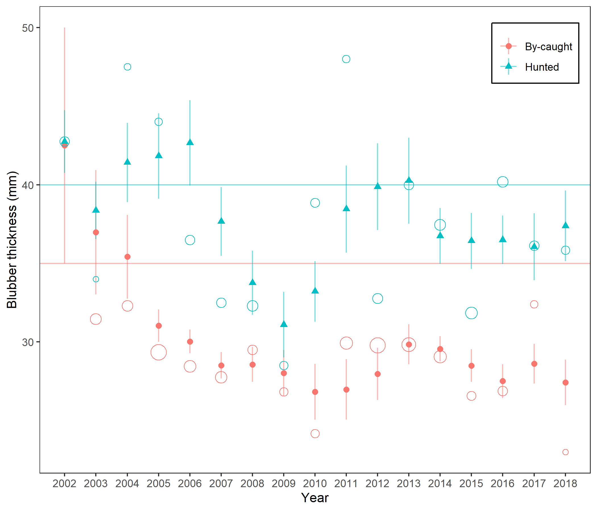
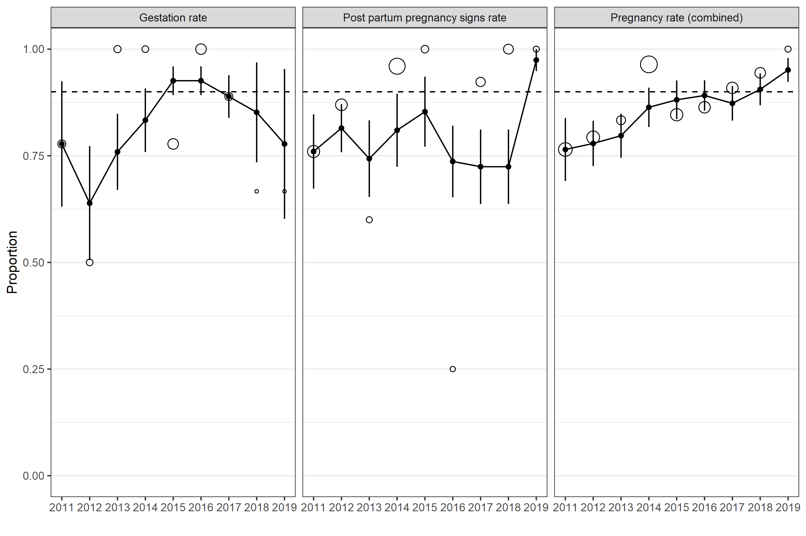
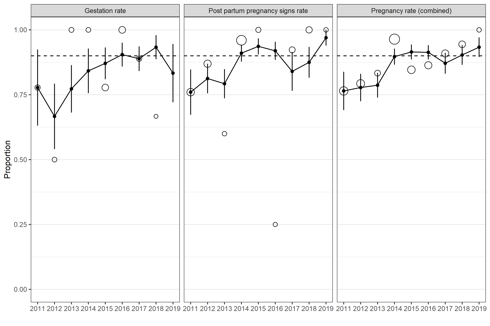

HELCOM Indicators
================

# Nutritional status of seals

This is an attempt to reproduce *Results figure 2* in the [Nutritional
status of
seals](https://www.helcom.fi/wp-content/uploads/2019/08/Nutritional-status-of-seals-HELCOM-core-indicator-2018.pdf)
report. Data is read from an Excel sheet into R

``` r
library(tidyverse)
data_blubber <- readxl::read_excel("Blubber thickness seals 2020.xlsx", sheet = "Data", na = ".") %>% 
  janitor::clean_names() %>% 
  mutate(cause_of_death = tolower(cause_of_death),
         age_years = as.numeric(age_years)) %>% 
  filter(!is.na(blubber_mm)) %>% 
  select(year, month, age_years, blubber_mm, cause_of_death)
glimpse(data_blubber)
```

    ## Rows: 876
    ## Columns: 5
    ## $ year           <dbl> 2010, 2010, 2010, 2010, 2010, 2010, 2010, 2010, 2011...
    ## $ month          <dbl> 6, 11, 11, 11, 12, 5, 5, 10, 5, 5, 5, 5, 5, 9, 11, 4...
    ## $ age_years      <dbl> 1, 3, 2, 1, 3, 3, 2, 3, 1, 1, 2, 2, 2, 3, 3, 1, 1, 2...
    ## $ blubber_mm     <dbl> 25, 30, 35, 40, 40, 45, 50, 60, 30, 30, 30, 30, 30, ...
    ## $ cause_of_death <chr> "hunted", "hunted", "by-caught", "hunted", "hunted",...

we extract seals caught in August-October, of 1-3 years and remove the
ones found stranded.

``` r
sub_data_blubber <- filter(data_blubber,
                           month %in% 8:12,
                           age_years >= 1, age_years <=3,
                           cause_of_death != "stranded")
```

According to the caption, the figure in the report shows three-year
moving averages. This could be interpreted as the average blubber
thickness in a three-year interval or the average *yearly average*
across three years. Since the number of seals differ between years,
these alternatives will give somewhat different results. We choose the
second interpretation. The function `get_mov_means` computes the moving
averages and standard errors for each cause of death a given year.

``` r
get_mov_means <- function(data, years, variable, group = NULL){
  map_df(years, function(y){
    filter(data, year %in% (y - 2):(y), !is.na({{ variable }})) %>% 
      group_by({{ group }}, year) %>% 
      summarise(y_mean = mean({{ variable }}),
                y_n = n(),
                y_var = var({{ variable }})/y_n,
                .groups = "drop"
      ) %>% 
      group_by({{ group }}) %>% 
      summarise(mov_mean = mean(y_mean),
                y_mean = y_mean[n()],
                n = y_n[n()],
                se = sqrt(sum(y_var)) / n(),
                .groups = "drop") %>% 
      mutate(year = y) %>% 
      ungroup()
  }
  )
}
```

We are now ready to summarise data by

``` r
summary_blubber <- get_mov_means(sub_data_blubber, 2002:2018, blubber_mm, cause_of_death) %>% 
  left_join(tibble(cause_of_death = c("by-caught", "hunted"), threshold = c(35, 40)),
            by = "cause_of_death")
glimpse(summary_blubber)
```

    ## Rows: 34
    ## Columns: 7
    ## $ cause_of_death <chr> "by-caught", "hunted", "by-caught", "hunted", "by-ca...
    ## $ mov_mean       <dbl> 42.50000, 42.75000, 36.97727, 38.37500, 35.41818, 41...
    ## $ y_mean         <dbl> 42.50000, 42.75000, 31.45455, 34.00000, 32.30000, 47...
    ## $ n              <int> 2, 8, 11, 3, 10, 4, 24, 5, 13, 8, 12, 8, 8, 10, 6, 6...
    ## $ se             <dbl> 7.5000000, 1.9977666, 3.9520499, 1.8251305, 2.665933...
    ## $ year           <int> 2002, 2002, 2003, 2003, 2004, 2004, 2005, 2005, 2006...
    ## $ threshold      <dbl> 35, 40, 35, 40, 35, 40, 35, 40, 35, 40, 35, 40, 35, ...

where also the different thresholds are added. Now we are ready to plot

``` r
fig_blubber <- summary_blubber %>% 
  ggplot(aes(x = year, color = cause_of_death, shape = cause_of_death)) +
  geom_hline(aes(yintercept = threshold, color = cause_of_death), alpha = .5) +
  geom_linerange(aes(ymin = mov_mean - se, ymax = mov_mean + se), alpha = .5)+
  geom_point(aes(y = mov_mean), size = 2) +
  geom_point(aes(y = y_mean, size = n), pch = 21, show.legend = FALSE) +
  scale_x_continuous(breaks = 2002:2018) + theme_bw() +
  ylab("Blubber thickness (mm)") + xlab("Year") + 
  theme(panel.grid.minor = element_blank(), 
        panel.grid.major = element_blank(), 
        legend.title = element_blank(),
        legend.position = c(.9, .9), legend.background = element_rect(color = "black")) +
  scale_color_discrete(labels = c("By-caught", "Hunted")) +
  scale_shape_discrete(labels = c("By-caught", "Hunted"))
ggsave(fig_blubber, filename = "blubber.png", height = 6, width = 7)

```


where the symbols show three-year running means with standard errors and
the circles yearly means with area proportional to the number of
observations they are based on.

# Reproductive status of seals

This is an attempt to (partially) reproduce *Results figure 2* in the
[Reproductive status of
seals](https://www.helcom.fi/wp-content/uploads/2019/08/Reproductive-status-of-seals-HELCOM-core-indicator-2018.pdf)
report. Data is read from an Excel sheet into R

``` r
data_rep <- readxl::read_excel("Reproductive data update 2020 Finland and Sweden.xlsx", 
                           sheet = "Data", na = ".") %>% 
  janitor::clean_names() %>% 
  select(country, year, reproductive_year, month, pregnancy_rate, gestation, ppp)
glimpse(data_rep)
```

    ## Rows: 249
    ## Columns: 7
    ## $ country           <chr> "Finland", "Finland", "Finland", "Finland", "Finl...
    ## $ year              <dbl> 2011, 2011, 2012, 2012, 2013, 2014, 2014, 2014, 2...
    ## $ reproductive_year <dbl> 2011, 2011, 2012, 2012, 2013, 2014, 2014, 2014, 2...
    ## $ month             <dbl> 7, 11, 11, 11, 9, 7, 7, 8, 10, 7, 7, 7, 10, 10, 1...
    ## $ pregnancy_rate    <dbl> 1, 0, 0, 1, 1, 1, 1, 1, 1, 0, 1, 1, 0, 0, 0, 1, 1...
    ## $ gestation         <dbl> 1, 0, 0, 1, 1, 1, 1, 1, 1, 0, 1, 1, 0, 0, 0, 1, 1...
    ## $ ppp               <dbl> NA, NA, NA, NA, NA, NA, NA, NA, NA, NA, NA, NA, N...

We filter out Swedish seals caught in July since the can’t be classified
correctly and years ouside of the interval 2011-2019

``` r
sub_data_rep <- filter(data_rep, !((country == "Sverige") & (month == 7)),
                   year %in% 2011:2019)
```

compute yearly summaries of the indicators

``` r
summary_rep <- bind_rows(
  mutate(get_mov_means(sub_data_rep, 2011:2019, ppp), label = "Post partum pregnancy signs rate"),
  mutate(get_mov_means(sub_data_rep, 2011:2019, gestation), label = "Gestation rate"),
  mutate(get_mov_means(sub_data_rep, 2011:2019, pregnancy_rate), label = "Pregnancy rate (combined)"),
)
glimpse(summary_rep)
```

    ## Rows: 27
    ## Columns: 6
    ## $ mov_mean <dbl> 0.7600000, 0.8147826, 0.7431884, 0.8098551, 0.8533333, 0.7...
    ## $ y_mean   <dbl> 0.7600000, 0.8695652, 0.6000000, 0.9600000, 1.0000000, 0.2...
    ## $ n        <int> 25, 23, 5, 50, 8, 4, 13, 15, 5, 9, 6, 7, 6, 18, 18, 9, 3, ...
    ## $ se       <dbl> 0.08717798, 0.05647018, 0.08991077, 0.08559543, 0.08218115...
    ## $ year     <int> 2011, 2012, 2013, 2014, 2015, 2016, 2017, 2018, 2019, 2011...
    ## $ label    <chr> "Post partum pregnancy signs rate", "Post partum pregnancy...

and plot

``` r
fig_rep1 <- summary_rep %>% ggplot(aes(x = year)) + 
  geom_point(aes(y = mov_mean)) + 
  geom_line(aes(y = mov_mean)) + 
  geom_linerange(aes(ymax = mov_mean + se, ymin = mov_mean - se)) + 
  geom_hline(yintercept = .9, linetype = 2) +
  geom_point(aes(y = y_mean, size = n), pch = 21, show.legend = FALSE) +
  facet_wrap(~label, ncol = 3) + ylim(c(0, 1)) + 
  theme_bw() +  scale_x_continuous(breaks = 2011:2019) +
  theme(panel.grid.minor.x = element_blank(), panel.grid.major.x = element_blank()) + 
  xlab("") + ylab("Proportion")
ggsave(fig_rep1, filename = "fig_rep1.png", width = 9, height = 6, type = "cairo")

```


Note that the numeber of observations vary widely between years. Since
the running mean gives equal weight to yearly means, years with very few
observations may largely influence the moving mean. A better idea is
probably to give equal weights to observations in the three-year window,
this requires an updated function

``` r
get_mov_means2 <- function(data, years, variable, group = NULL){
  map_df(years, function(y){
    filter(data, year %in% (y - 2):(y), !is.na({{ variable }})) %>% 
      group_by({{ group }}) %>% 
      summarise(mov_mean = mean({{ variable }}),
                y_mean = mean({{ variable }}[year == y]),
                n = length({{ variable }}[year == y]),
                se = sd({{ variable }})/sqrt(n())) %>% 
      mutate(year = y) %>% 
      ungroup()
  }
  )
}
```

which is applied as before

``` r
summary_rep <- bind_rows(
  mutate(get_mov_means2(sub_data_rep, 2011:2019, ppp), label = "Post partum pregnancy signs rate"),
  mutate(get_mov_means2(sub_data_rep, 2011:2019, gestation), label = "Gestation rate"),
  mutate(get_mov_means2(sub_data_rep, 2011:2019, pregnancy_rate), label = "Pregnancy rate (combined)"),
)
glimpse(summary_rep)
```

    ## Rows: 27
    ## Columns: 6
    ## $ mov_mean <dbl> 0.7600000, 0.8125000, 0.7924528, 0.9102564, 0.9365079, 0.9...
    ## $ y_mean   <dbl> 0.7600000, 0.8695652, 0.6000000, 0.9600000, 1.0000000, 0.2...
    ## $ n        <int> 25, 23, 5, 50, 8, 4, 13, 15, 5, 9, 6, 7, 6, 18, 18, 9, 3, ...
    ## $ se       <dbl> 0.08717798, 0.05693291, 0.05623976, 0.03257154, 0.03096846...
    ## $ year     <int> 2011, 2012, 2013, 2014, 2015, 2016, 2017, 2018, 2019, 2011...
    ## $ label    <chr> "Post partum pregnancy signs rate", "Post partum pregnancy...

and plot

``` r
fig_rep2 <- summary_rep %>% ggplot(aes(x = year)) + 
  geom_point(aes(y = mov_mean)) + 
  geom_line(aes(y = mov_mean)) + 
  geom_linerange(aes(ymax = mov_mean + se, ymin = mov_mean - se)) + 
  geom_hline(yintercept = .9, linetype = 2) +
  geom_point(aes(y = y_mean, size = n), pch = 21, show.legend = FALSE) +
  facet_wrap(~label, ncol = 3) + ylim(c(0, 1)) + 
  theme_bw() +  scale_x_continuous(breaks = 2011:2019) +
  theme(panel.grid.minor.x = element_blank(), panel.grid.major.x = element_blank()) + 
  xlab("") + ylab("Proportion")
ggsave(fig_rep2, filename = "fig_rep2.png", width = 9, height = 6, type = "cairo")

```


