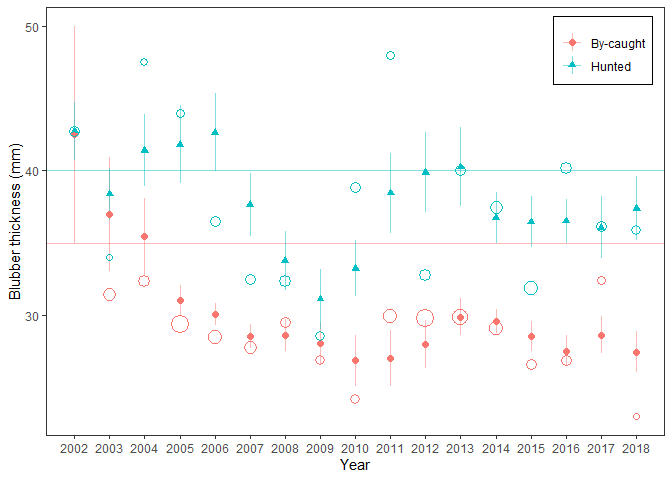
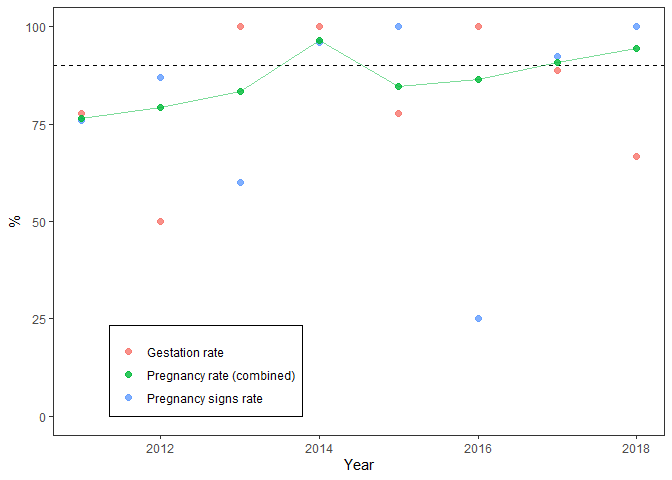

HELCOM Indicators
================

# Nutritional status of seals

This is an attempt to reproduce *Results figure 2* in the [Nutritional
status of
seals](https://www.helcom.fi/wp-content/uploads/2019/08/Nutritional-status-of-seals-HELCOM-core-indicator-2018.pdf)
report. Data is read from an Excel sheet into R

``` r
library(tidyverse)
data <- readxl::read_excel("Blubber thickness seals 2020.xlsx", sheet = "Data") %>% 
  janitor::clean_names() %>% 
  mutate(cause_of_death = tolower(cause_of_death),
         age_years = as.numeric(age_years)) %>% 
  filter(!is.na(blubber_mm)) %>% 
  select(year, month, age_years, blubber_mm, cause_of_death)
glimpse(data)
```

    ## Rows: 876
    ## Columns: 5
    ## $ year           <dbl> 2010, 2010, 2010, 2010, 2010, 2010, 2010, 2010, 2011...
    ## $ month          <chr> "6", "11", "11", "11", "12", "5", "5", "10", "5", "5...
    ## $ age_years      <dbl> 1, 3, 2, 1, 3, 3, 2, 3, 1, 1, 2, 2, 2, 3, 3, 1, 1, 2...
    ## $ blubber_mm     <dbl> 25, 30, 35, 40, 40, 45, 50, 60, 30, 30, 30, 30, 30, ...
    ## $ cause_of_death <chr> "hunted", "hunted", "by-caught", "hunted", "hunted",...

we extract seals caught in August-October, of 1-3 years and remove the
ones found stranded.

``` r
sub_data <- filter(data,
                   month %in% 8:12,
                   age_years >= 1, age_years <=3,
                   cause_of_death != "stranded")
```

According to the caption, the figure in the report shows three-year
moving averages. This could be interpreted as the average blubber
thickness in a three-year interval or the average *yearly average*
across three years. Since the number of seals differ between years,
these alternatives will give somewhat different results. We choose the
second interpretation. The function `get_mov_means` computes the moving
averages and standard errors for each cause of death a given year.

``` r
get_mov_mean <- function(data, y){
  filter(data, year %in% (y - 1):(y + 1)) %>% 
    group_by(cause_of_death, year) %>% 
    summarise(mean_blub = mean(blubber_mm),
              n_blub = n(),
              var_blub_mean = var(blubber_mm)/n_blub
    ) %>% 
    group_by(cause_of_death) %>% 
    summarise(mov_mean = mean(mean_blub),
              n = n(),
              se = sqrt(sum(var_blub_mean)) / n) %>% 
    mutate(year = y) %>% 
    ungroup() %>% 
    na.omit()
}
```

We are now ready to summarise data by

``` r
years <- 2002:2018
summary_data <- map_df(years, ~get_mov_mean(sub_data, .x)) %>% 
  left_join(tibble(cause_of_death = c("by-caught", "hunted"), threshold = c(35, 40)),
            by = "cause_of_death")
glimpse(summary_data)
```

    ## Rows: 34
    ## Columns: 6
    ## $ cause_of_death <chr> "by-caught", "hunted", "by-caught", "hunted", "by-ca...
    ## $ mov_mean       <dbl> 36.97727, 38.37500, 35.41818, 41.41667, 31.02929, 41...
    ## $ n              <int> 2, 2, 3, 3, 3, 3, 3, 3, 3, 3, 3, 3, 3, 3, 3, 3, 3, 3...
    ## $ se             <dbl> 3.9520499, 1.8251305, 2.6659331, 2.5182535, 1.028371...
    ## $ year           <int> 2002, 2002, 2003, 2003, 2004, 2004, 2005, 2005, 2006...
    ## $ threshold      <dbl> 35, 40, 35, 40, 35, 40, 35, 40, 35, 40, 35, 40, 35, ...

where also the different thresholds are added. Now we are ready to plot

``` r
summary_data %>% 
  ggplot(aes(x = year, y = mov_mean, color = cause_of_death, shape = cause_of_death)) +
  geom_hline(aes(yintercept = threshold, color = cause_of_death), 
             linetype = 2, show.legend = FALSE, size = .7) +
  geom_line(alpha = .5) +
  geom_linerange(aes(ymin = mov_mean - se, ymax = mov_mean + se), alpha = .5)+
  geom_point(size = 2) +
  scale_x_continuous(breaks = 2002:2019) + theme_bw() +
  ylab("Blubber thickness (mm)") + xlab("Year") + 
  theme(panel.grid.minor = element_blank(), 
        panel.grid.major = element_blank(), 
        legend.title = element_blank(),
        legend.position = c(.9, .9), legend.background = element_rect(color = "black")) +
  scale_color_discrete(labels = c("By-caught", "Hunted")) +
  scale_shape_discrete(labels = c("By-caught", "Hunted"))
```

<!-- -->

# Reproductive status of seals

This is an attempt to (partially) reproduce *Results figure 2* in the
[Reproductive status of
seals](https://www.helcom.fi/wp-content/uploads/2019/08/Reproductive-status-of-seals-HELCOM-core-indicator-2018.pdf)
report. Data is read from an Excel sheet into R

``` r
data <- readxl::read_excel("Reproductive data update 2020 Finland and Sweden.xlsx", 
                           sheet = "Data", na = ".") %>% 
  janitor::clean_names() %>% 
  select(country, year, reproductive_year, month, pregnancy_rate, gestation, ppp)
glimpse(data)
```

    ## Rows: 249
    ## Columns: 7
    ## $ country           <chr> "Finland", "Finland", "Finland", "Finland", "Finl...
    ## $ year              <dbl> 2011, 2011, 2012, 2012, 2013, 2014, 2014, 2014, 2...
    ## $ reproductive_year <dbl> 2011, 2011, 2012, 2012, 2013, 2014, 2014, 2014, 2...
    ## $ month             <dbl> 7, 11, 11, 11, 9, 7, 7, 8, 10, 7, 7, 7, 10, 10, 1...
    ## $ pregnancy_rate    <dbl> 1, 0, 0, 1, 1, 1, 1, 1, 1, 0, 1, 1, 0, 0, 0, 1, 1...
    ## $ gestation         <dbl> 1, 0, 0, 1, 1, 1, 1, 1, 1, 0, 1, 1, 0, 0, 0, 1, 1...
    ## $ ppp               <dbl> NA, NA, NA, NA, NA, NA, NA, NA, NA, NA, NA, NA, N...

We filter out Swedish seals caught in July since the can’t be classified
correctly and years ouside of the interval 2011-2018

``` r
sub_data <- filter(data, !((country == "Sverige") & (month == 7)),
                   year %in% 2011:2018)
```

compute yearly summaries of the indicators

``` r
summary_data <- sub_data %>% 
  group_by(year) %>%
  summarise(`Gestation rate` = mean(gestation, na.rm = TRUE),
            n_gestation = sum(!is.na(gestation)),
            `Pregnancy signs rate` = mean(ppp, na.rm = TRUE),
            n_ppp = sum(!is.na(ppp)),
            `Pregnancy rate (combined)` = mean(pregnancy_rate, na.rm = TRUE),
            n_pregnancy_rate = sum(!is.na(pregnancy_rate))
  )
glimpse(summary_data)
```

    ## Rows: 8
    ## Columns: 7
    ## $ year                        <dbl> 2011, 2012, 2013, 2014, 2015, 2016, 201...
    ## $ `Gestation rate`            <dbl> 0.7777778, 0.5000000, 1.0000000, 1.0000...
    ## $ n_gestation                 <int> 9, 6, 7, 6, 18, 18, 9, 3
    ## $ `Pregnancy signs rate`      <dbl> 0.7600000, 0.8695652, 0.6000000, 0.9600...
    ## $ n_ppp                       <int> 25, 23, 5, 50, 8, 4, 13, 15
    ## $ `Pregnancy rate (combined)` <dbl> 0.7647059, 0.7931034, 0.8333333, 0.9642...
    ## $ n_pregnancy_rate            <int> 34, 29, 12, 56, 26, 22, 22, 18

Before plotting we convert to long format

``` r
plot_data <- summary_data %>% 
  select(-starts_with("n_")) %>% 
  pivot_longer(-year, names_to = "indicator", values_to = "value")
```

and plot

``` r
plot_data %>% ggplot(aes(x = year, y = 100*value, color = indicator)) + 
  geom_hline(yintercept = 90, linetype = 2) +
  geom_point(size = 2, alpha = .8) + 
  geom_line(data = filter(plot_data, indicator == "Pregnancy rate (combined)"), 
            alpha = .5, show.legend = FALSE) +
  ylim(c(0, 100)) + theme_bw() +
  theme(panel.grid.minor = element_blank(), 
        panel.grid.major = element_blank(), 
        legend.title = element_blank(),
        legend.position = c(.25, .15), 
        legend.background = element_rect(color = "black")) +
  xlab("Year") + ylab("%")
```

<!-- -->
